# CanIPhish Phishing Simulation

[← Back to Project Overview](../README.md)

## Overview
[CanIPhish](https://caniphish.com/) is an AI-powered phishing simulation and adaptive security awareness training platform.

## Pricing & Licensing
During our research, the following pricing and tier information was identified:

- **Free Edition (Community Tier):** €0/month for up to **10 employees**. This is a fully functional tier designed for small teams or initial testing.
- **Paid Tiers:** Scaling plans starting at approximately **€0.42/user/month** for a 1000 user license.
- **Enterprise Add-ons:** Advanced features such as SSO, White-labelling, and Deepfake Voice Phishing are available as optional add-ons.

## Key Features
- **Phishing Simulations:** Support for standard Email phishing, Conversational Email Phishing, and Deepfake Voice Phishing.
- **Adaptive Training:** Over 60 learning modules that adapt based on employee performance and risk profiles.
- **Human Risk Management:** Detailed employee risk profiling.
- **Direct Email Injection:** Bypasses traditional email filters by injecting simulations directly into M365 mailboxes via API.
- **Directory Synchronization:** Seamlessly syncs users from **Microsoft Entra ID (Azure AD)** and **Google Workspace** for automated onboarding and management (paid tiers).

## Platform Walkthrough

### 1. Setup & Integration
The setup process is streamlined through a series of verification and integration steps:

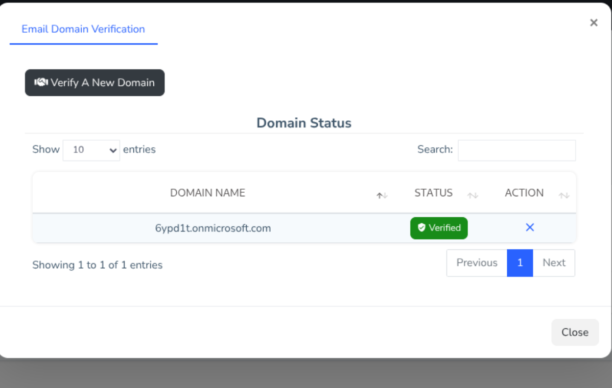
*Domain verification authorizes CanIPhish to send simulations to the specified domain.*

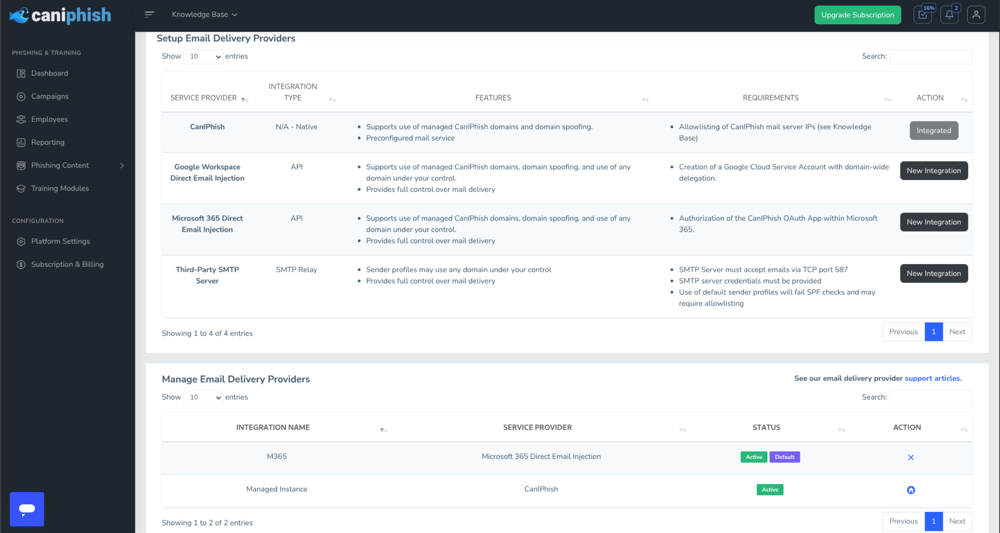
*Configured for **Microsoft 365 Direct Email Injection**, bypassing traditional mail filters via the Graph API.*

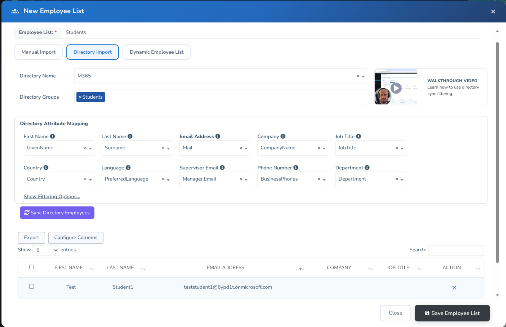
*Automated employee onboarding via Microsoft Entra ID sync. I imported users from the group "Students" via Entra ID*

### 2. Campaign Configuration
Creating a campaign follows a guided 5-step wizard, from employee selection to choosing phishing templates and selecting training.

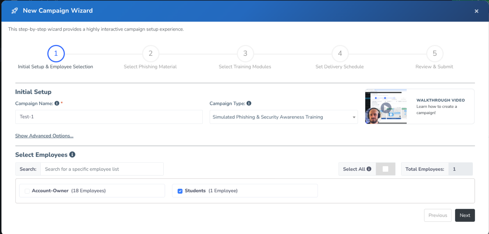
*I selected the "Students" group I imported from Entra ID*
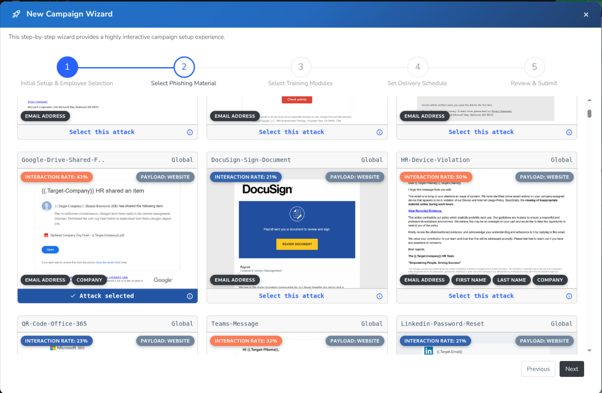
*I selected google drive shared file as the phishing template*
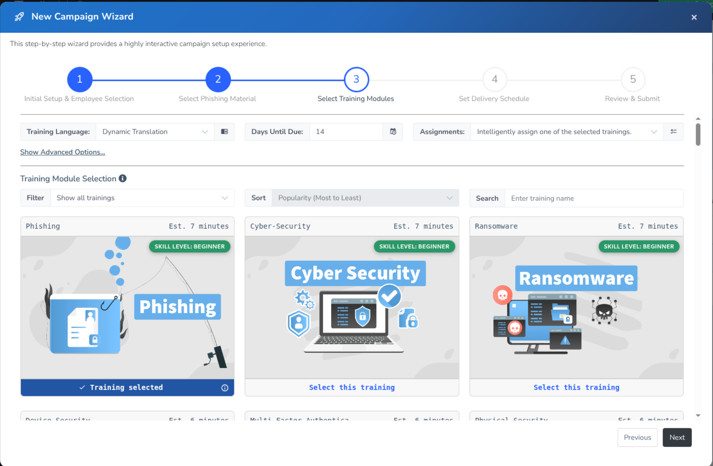
*I selected the training module "Phishing"*
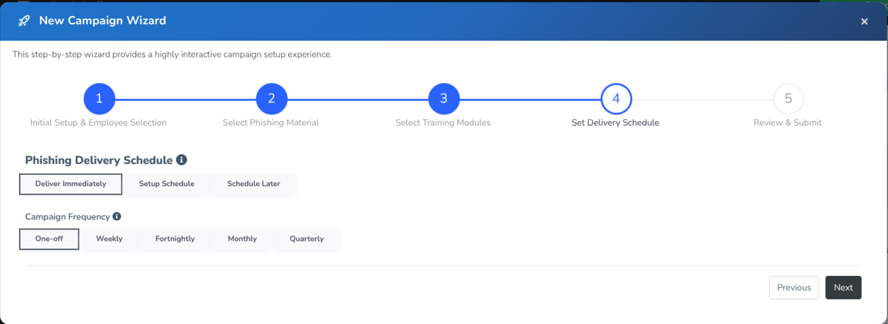
*I scheduled the campaign to run immediately*
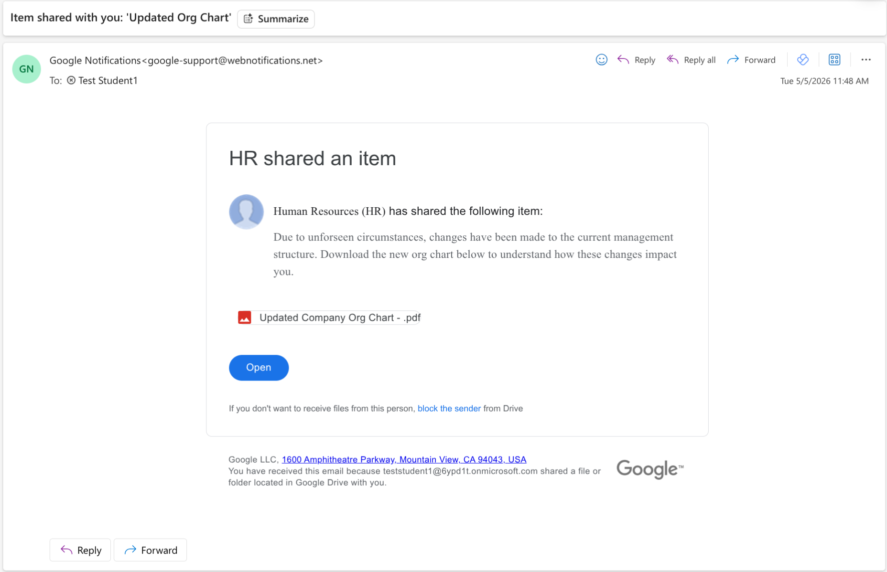
*The phishing email was sent to the students*

### 3. Adaptive Training & Education
CanIPhish provides a library of training modules. You can choose to assign training based on user behaviour:
*   **Clicked on payloads:** Assign training to users who interacted with the phishing link.
*   **Compromised:** Assign training only to users who leaked their credentials.

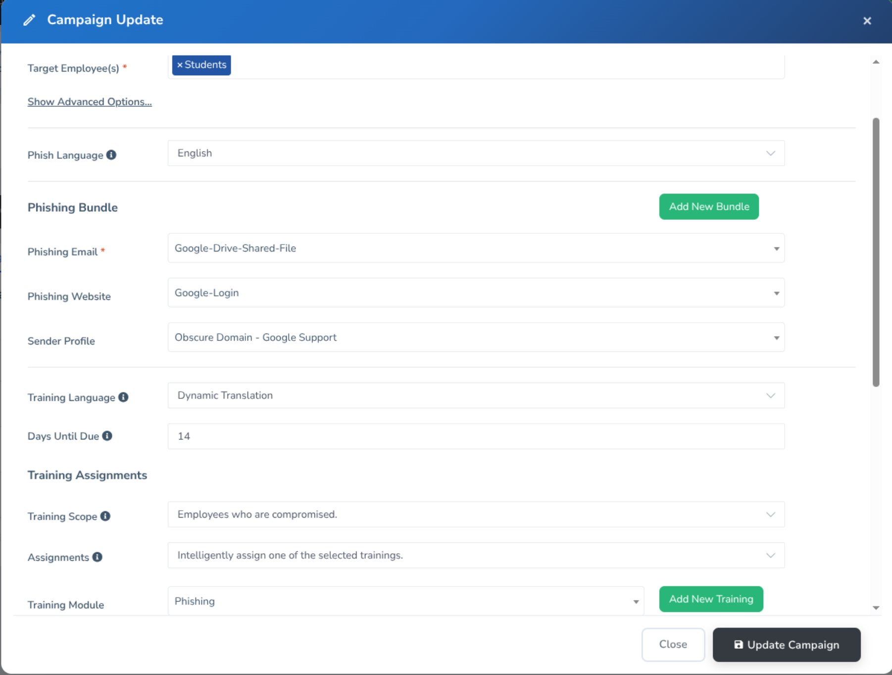
*Training scope to configure when training should be assigned.*

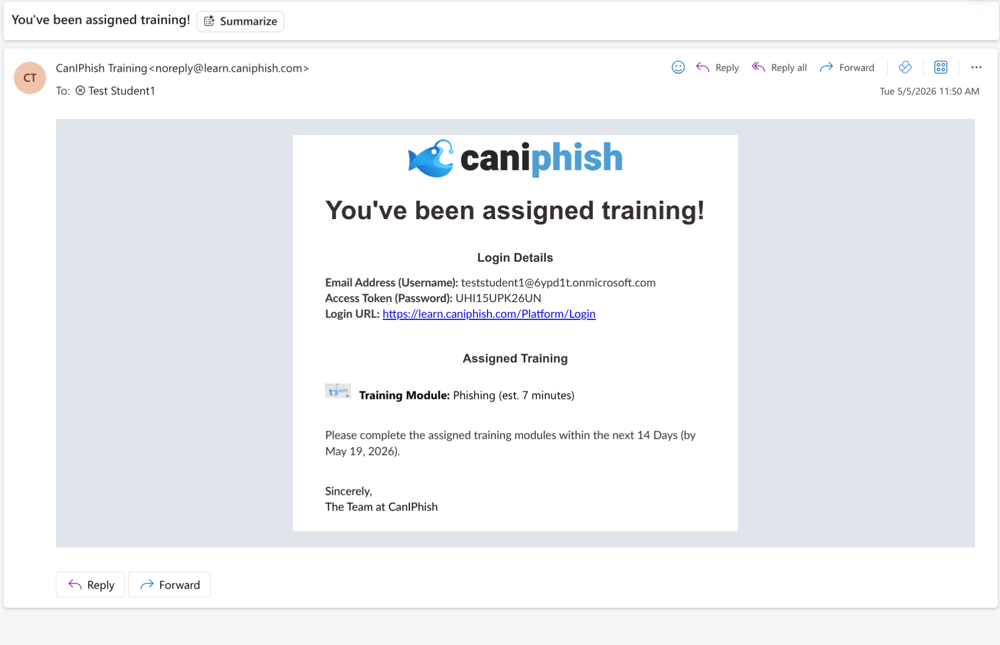
*The email the students received*
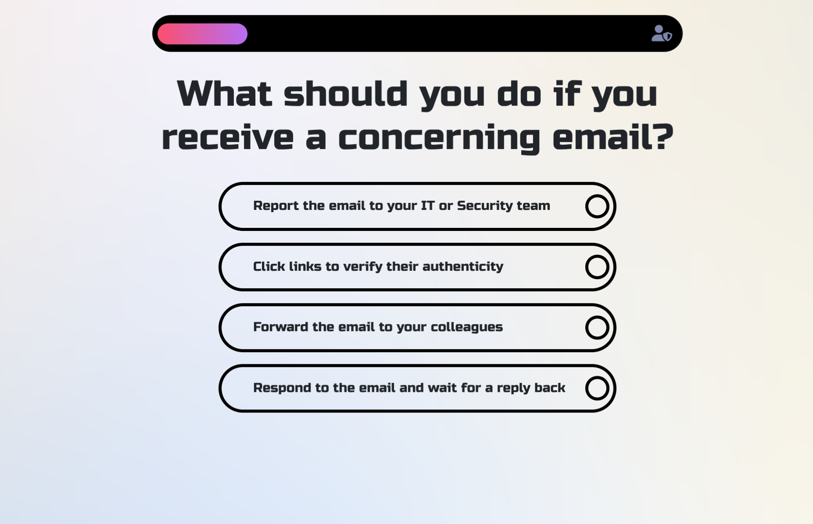
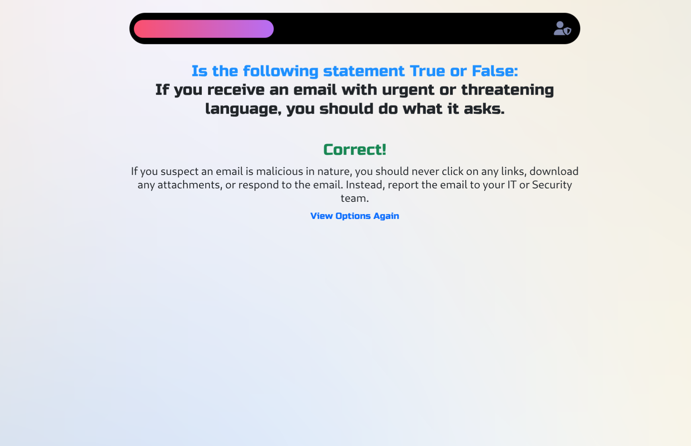
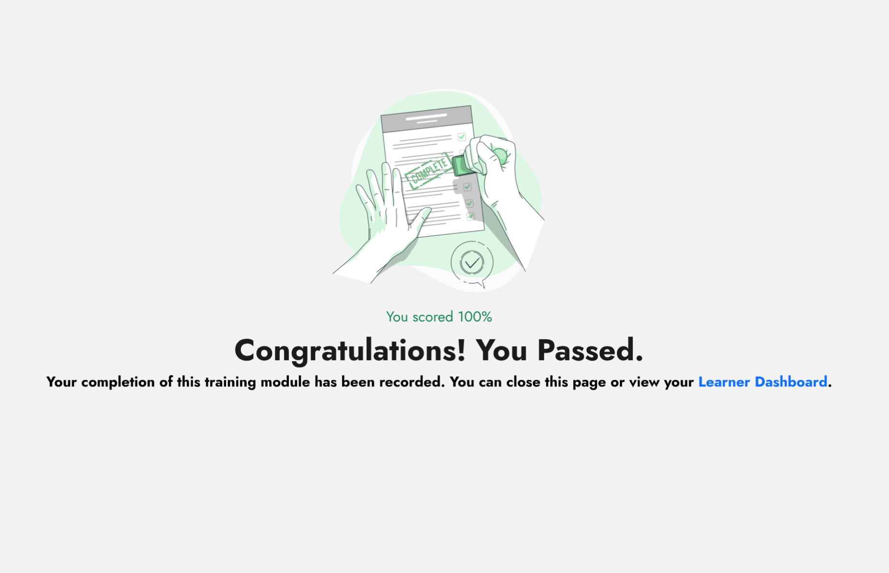

### 4. Reporting
There is also a reporting section where you can see the results of the phishing simulations.
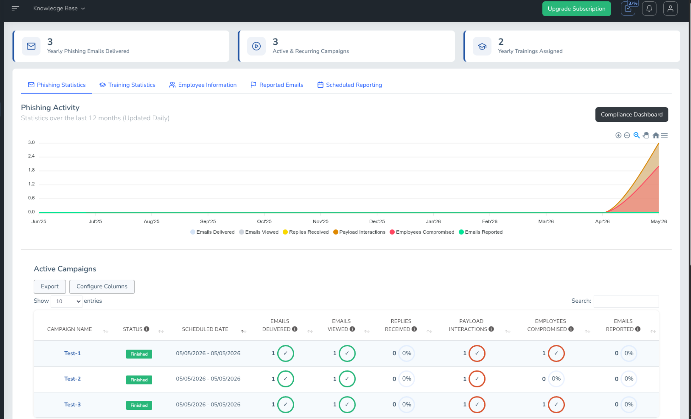

## Free Plan
The free plan has the following limitations:
- 10 employees
- No Single Sign-On (Used when accessing training)
- And more

See [Caniphish Pricing](https://caniphish.com/platform/pricing) for more information.

## Setup & Deployment
- **Deployment Options:** Supports both traditional **Allowlisting** (IPs/Headers) and  **Direct Email Injection** via the Microsoft 365 Graph API for reliable delivery.
- **Quick Reference:** A comprehensive [Knowledge Base](https://help.caniphish.com/) is available, including specific guides for [Microsoft Entra ID Synchronization](https://help.caniphish.com/hc/en-us/articles/4412685120911-Azure-AD-Employee-Directory-Synchronisation) and [M365 Direct Email Injection](https://help.caniphish.com/hc/en-us/articles/8548753938319-Microsoft-365-Direct-Email-Injection-Setup-Guide).
