# Phishing Simulation Guide

## Prerequisites & Initial Setup

To prepare the environment for a phishing simulation, complete the following steps:

1. **Provision the Microsoft 365 Sandbox**
   - Obtain a **Visual Studio Professional** subscription.
   - On the Visual Studio benefits page, click **Join now** for the **Microsoft 365 Developer Subscription** to provision your tenant.

2. **Configure Identity & Permissions**
   - **Create Users:** Access the [Microsoft 365 Admin Center](https://admin.cloud.microsoft/) to create the target user accounts (e.g., `teststudent1`).
   - **Assign Roles:** Navigate to [Microsoft Entra ID](https://entra.microsoft.com/) and assign the **Attack Simulation Administrator** role to the account managing the simulations.

3. **Access the Simulation Portal**
   - Go to the [Microsoft 365 Defender Portal](https://security.microsoft.com/).
   - Navigate to **Email & collaboration** > **Attack simulation training** in the sidebar menu.

---

## Launching a Simulation

Follow these steps to configure and launch your phishing campaign:

1. **Initiate Simulation**
   - In the **Attack simulation training** dashboard, click **Launch a simulation**.
   
   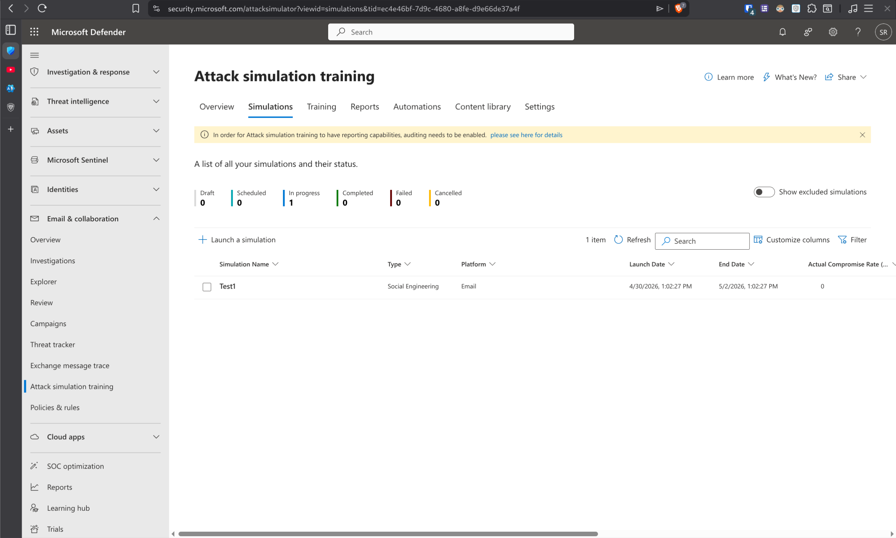
   - Select **Credential Harvest** as the technique.

   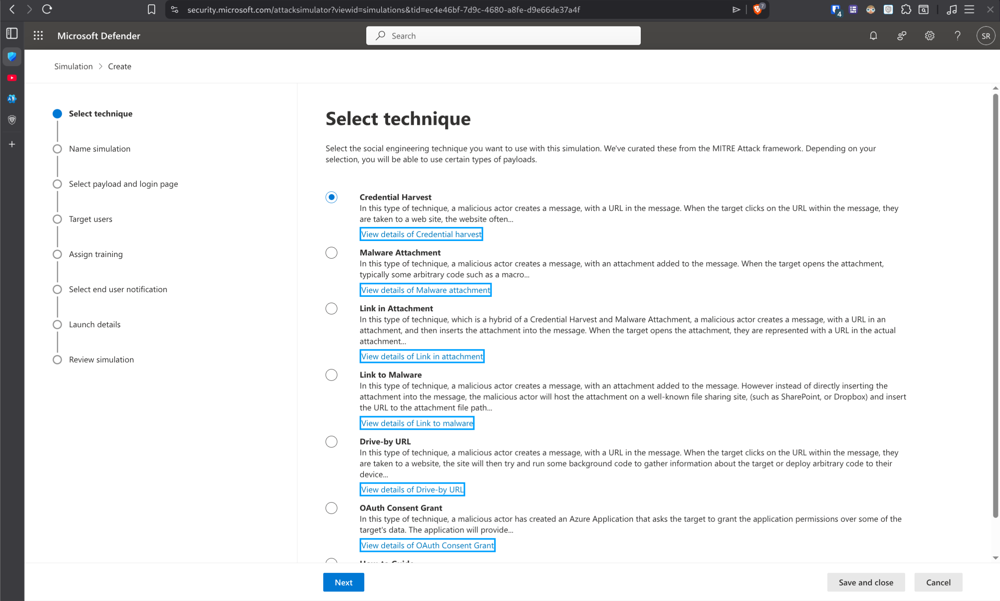
   

2. **Campaign Configuration**
   - **Simulation Name:** Assign a name to your campaign.
     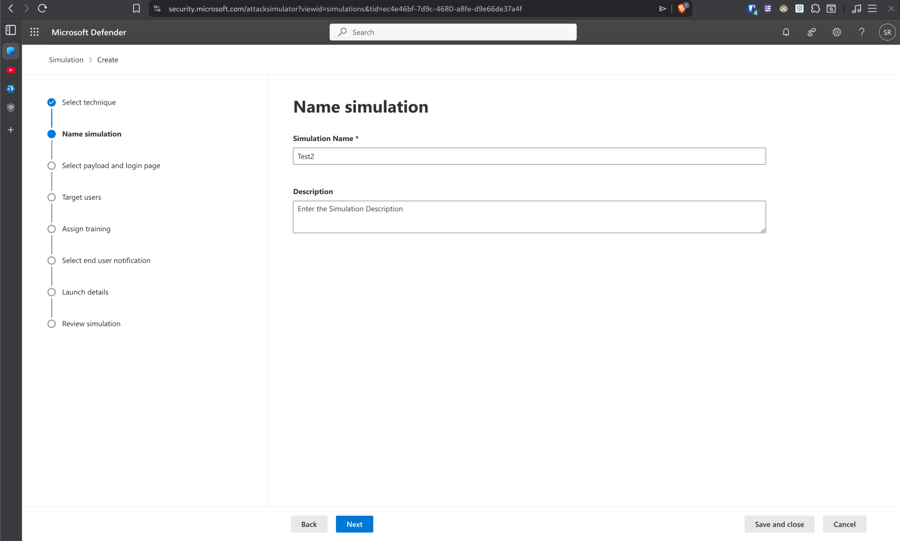
   - **Payload Selection:** Choose a payload from the library. 
     - *Note: In this simulation, "Payroll work file sharing" was selected (predicted compromise rate: 42%).*
     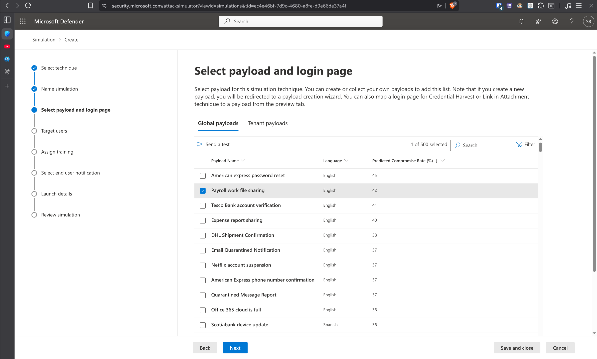
   - **Target Users:** Select the specific users or groups to target (e.g., `teststudent1`).
     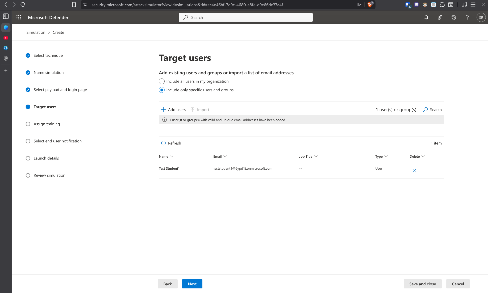

3. **Training & Landing Pages**
   - **Training Assignment:** Configure the training experience for targeted users.
     - **Default Option:** The *Microsoft training experience* (used in this simulation) assigns training to any user who interacts with the phishing link.
       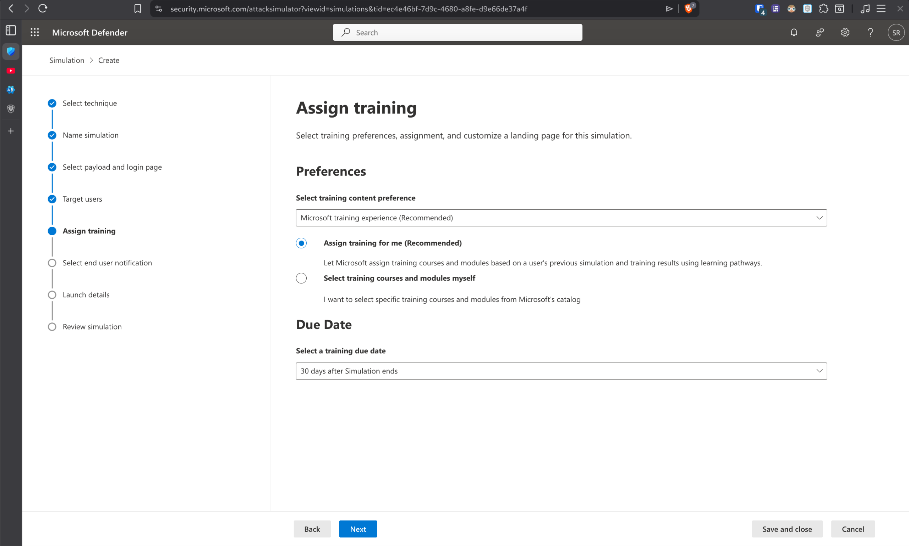
     - **Customized Triggering:** To restrict training to only "compromised" users (those who submit credentials), select **Select training courses and modules myself**.
       
     - On the follow-up page, add your chosen modules and set the **Assign to** dropdown to **Compromised**.
       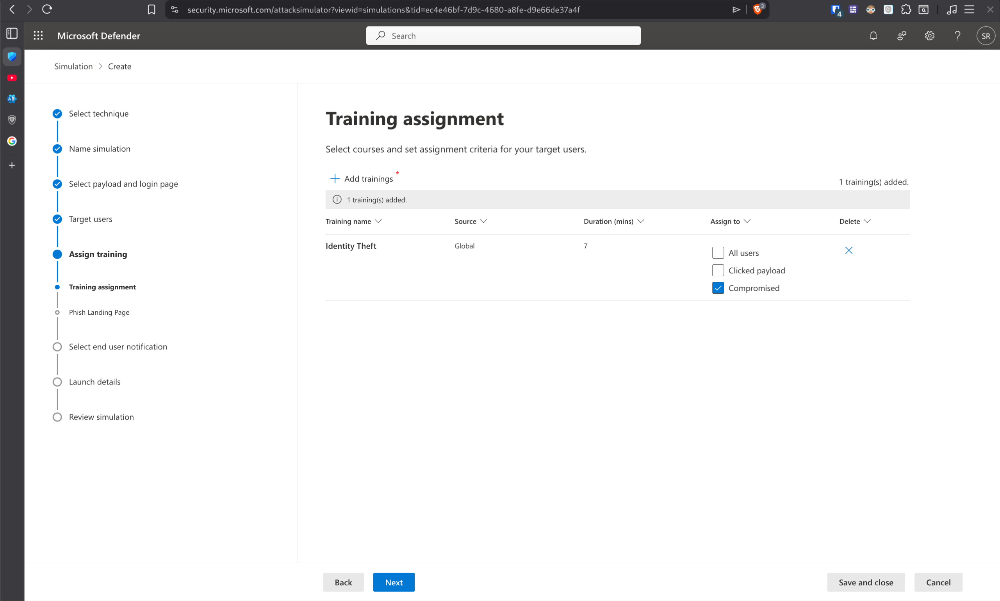
   - **Landing Page:** Choose the page users see after clicking the phishing link and "logging in." You can use the library defaults or a custom URL.
     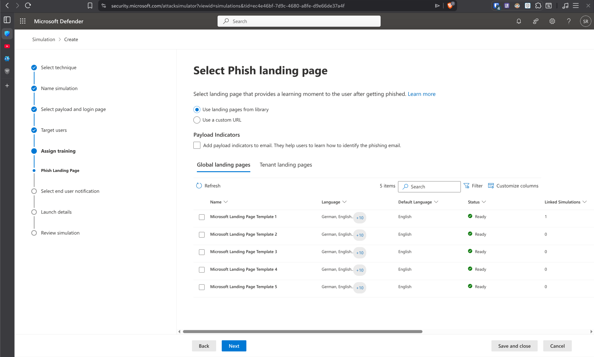

4. **End-User Notifications**
   - Set the notification type (e.g., **Microsoft default notification**). These include:
     - **Positive Reinforcement:** Notifies the user they were part of a simulation after a successful "attack."
     - **Training Assignment:** Notifies the user that training has been assigned.
     - **Training Reminder:** Sends periodic reminders until the training is completed.
     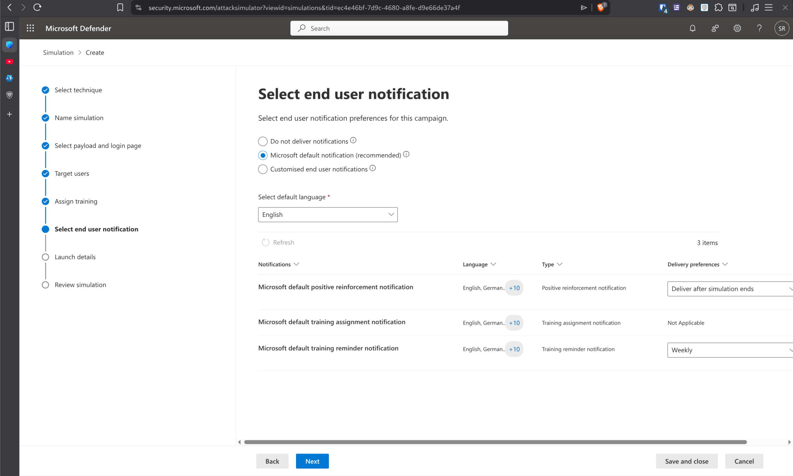

5. **Schedule & Review**
   - **Launch Details:** Define the start time (e.g., *Immediately*) and the duration of the simulation (e.g., *2 days*).
     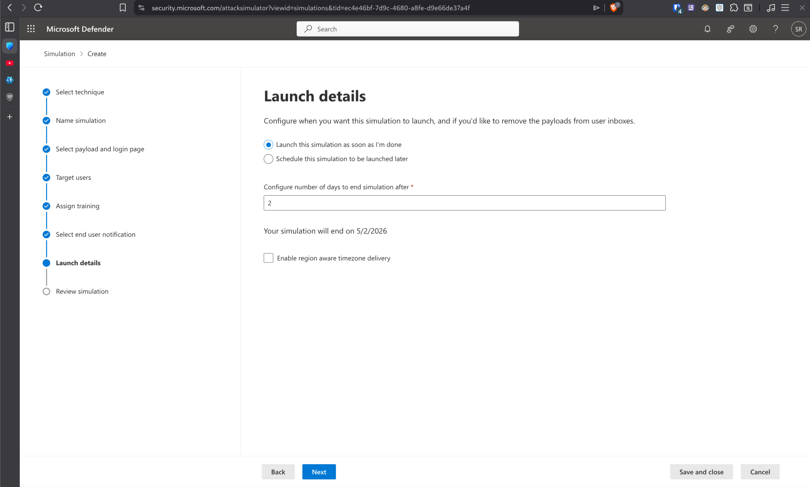
   - **Review:** Carefully verify all configurations and click **Submit** to launch the simulation.
     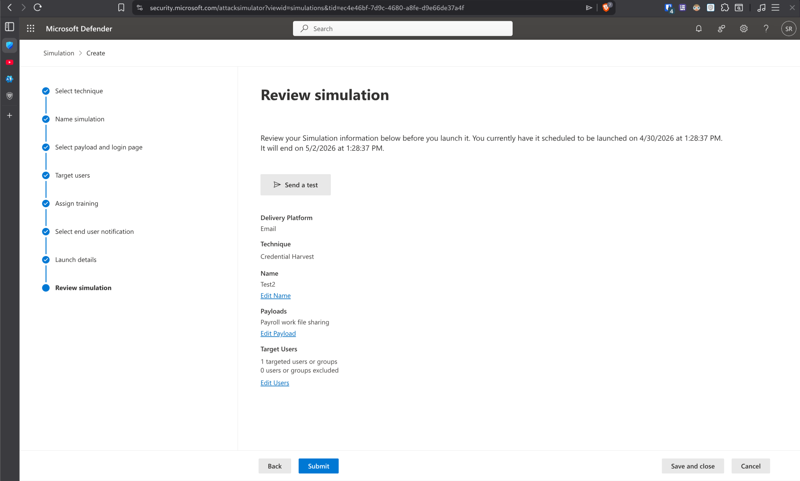

---

## Simulation Results

Once the simulation is active, you can monitor the results in the **Attack simulation training** dashboard.

### Phishing Email & Domain Verification
The target user receives a crafted email designed to entice them into clicking a link. The email originates from one of the domains [officially listed by Microsoft](https://learn.microsoft.com/en-us/defender-office-365/attack-simulation-training-get-started#simulations) for phishing simulations.

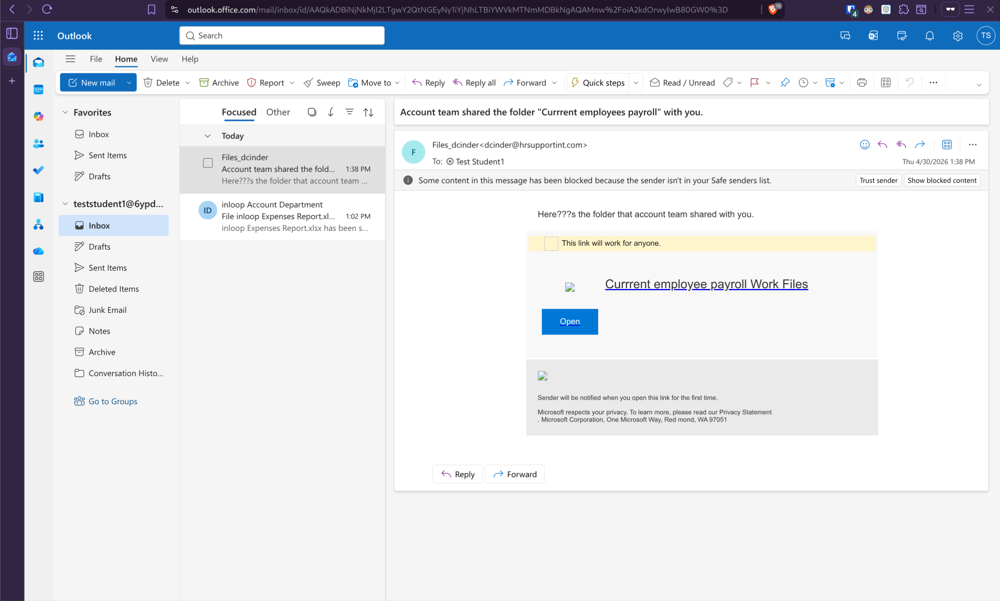

### Compromised User Evidence
The following screenshot confirms that `teststudent1` has been successfully compromised by the simulation:

To be registered as compromised, the user had to click the link in the email and log in with their credentials. Notably, the simulation recorded the compromise upon the initial login attempt; the user did not have to enter a 2FA code for the simulation to register them as compromised, even though 2FA was enabled for the account.

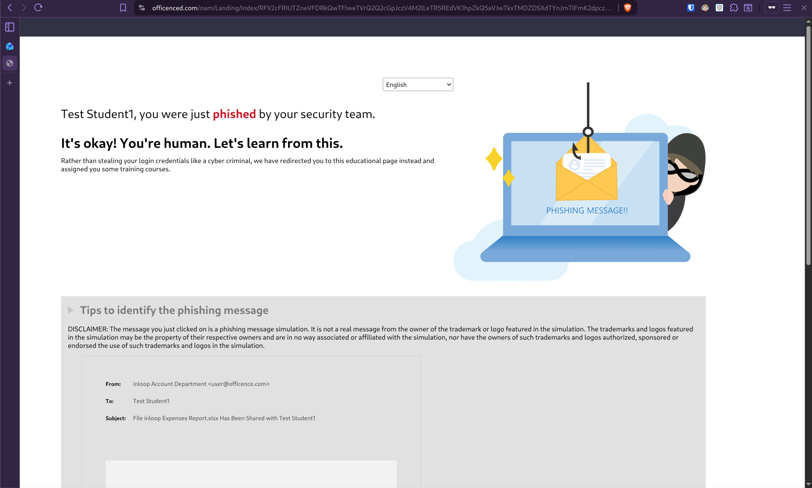

### Training Assignment
Following the user interaction, the system automatically sends a training assignment email to the target.

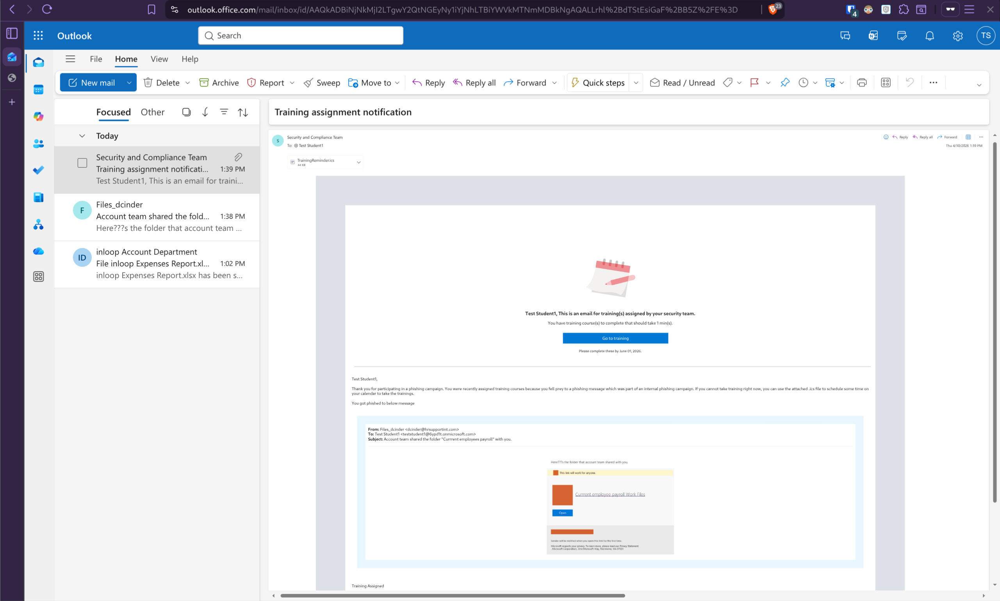

**Note on Training Configuration:**
In this specific simulation, the user received a training email immediately after **clicking the link** without submitting credentials. This occurs when using the default "Microsoft training experience." However, it is possible to limit training assignments to only "compromised" users by manually selecting training modules and setting the assignment trigger to **Compromised** (as shown in the configuration section above) instead of the default interaction-based trigger.

### Campaign Overview
The dashboard provides a high-level summary of the simulation's impact, including the number of users targeted and the total compromise rate.

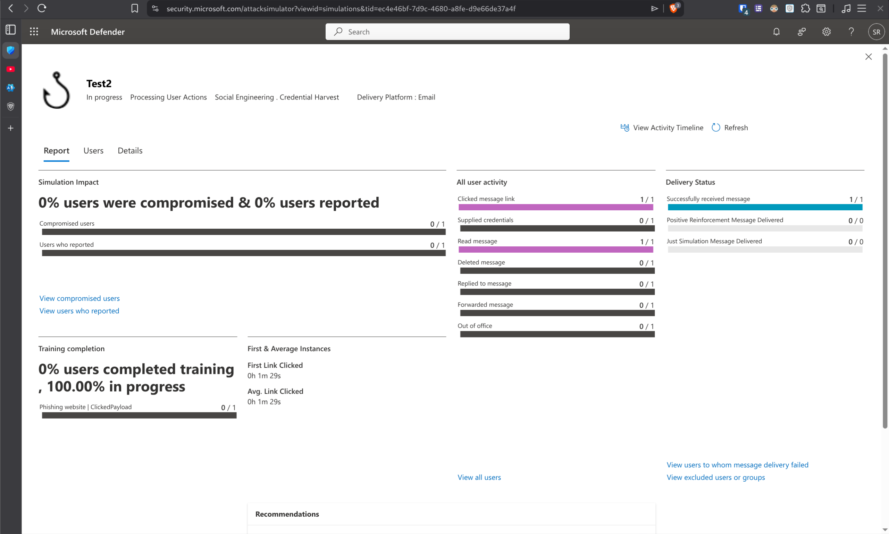

