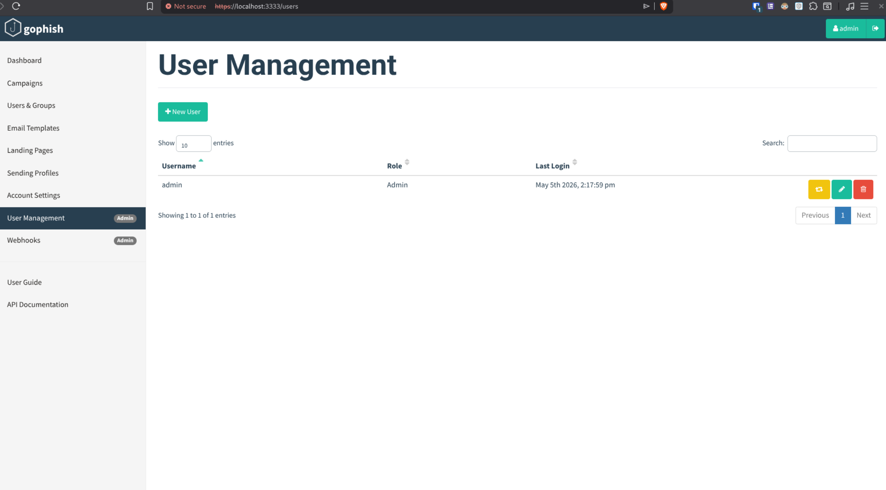
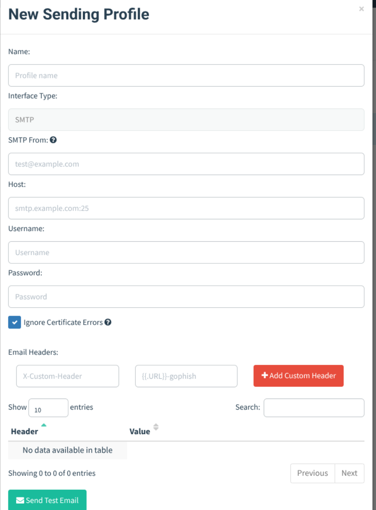

# Gophish
Open-Source Phishing Framework

## Deployment

The easiest way to run Gophish is using Docker. This ensures all dependencies are met and the environment is isolated.

```bash
docker run -d --name gophish -p 3333:3333 -p 80:80 -p 443:443 gophish/gophish
```

*   **Port 3333**: Admin Panel (HTTPS)
*   **Port 80/443**: Phishing Landing Pages

## Key Considerations & Limitations

During the evaluation, several significant hurdles were identified that make Gophish less ideal for quick deployments:

### 1. Manual User Management
Unlike modern SaaS platforms, Gophish does **not** support direct synchronization with Microsoft Entra ID (Azure AD).
*   **Manual Entry**: Users must be added one by one through the UI.
*   **API Automation**: For large-scale student simulations, a custom script would be required to fetch users from the Graph API and push them to Gophish via its own REST API.



### 2. SMTP Server Requirement
Gophish does not provide an integrated mail delivery service. It acts only as a "sending engine."
*   You must provide your own **SMTP Server** (e.g., SendGrid, Mailgun, or a local Postfix/Exchange server).
*   It does **not** support direct email injection or API-based sending for providers like M365 without SMTP authentication.



## Conclusion

Gophish is an excellent tool for **advanced users** who require total control over their data and simulation flow. However, for a university environment looking for a streamlined process to target thousands of students, the lack of native Entra ID integration and the requirement for a dedicated SMTP relay makes it a high-maintenance choice compared to integrated cloud alternatives.

---

## HailBytes SAT (Recommended Alternative)

HailBytes SAT (formerly **Gophish Cloud**) is a professional version of the open-source Gophish framework. It is highly recommended over a manual Gophish setup because it solves the manual user management problem while retaining full control.

### Why Choose HailBytes SAT?

*   **Entra ID Synchronization (SCIM 2.0)**: Unlike the open-source version, HailBytes SAT allows you to sync users directly from Microsoft Entra ID. This eliminates the need for manual entry or custom API scripts.
*   **Single Sign-On (SSO)**: Administrators can log in using their Thomas More Microsoft accounts via SAML/OIDC.
*   **Single-Click Deployment**: HailBytes SAT can be deployed instantly from the **Azure Marketplace** or **AWS Marketplace** as a pre-configured Virtual Machine. This avoids the manual infrastructure setup required for standard Gophish.
*   **SMTP Still Required**: While the infrastructure is managed, you still need to configure your own **SMTP Server** (same as Gophish) to send the emails.

For more details, see the [HailBytes SAT Quickstart](https://hailbytes.com/tutorials/sat-quickstart/).
