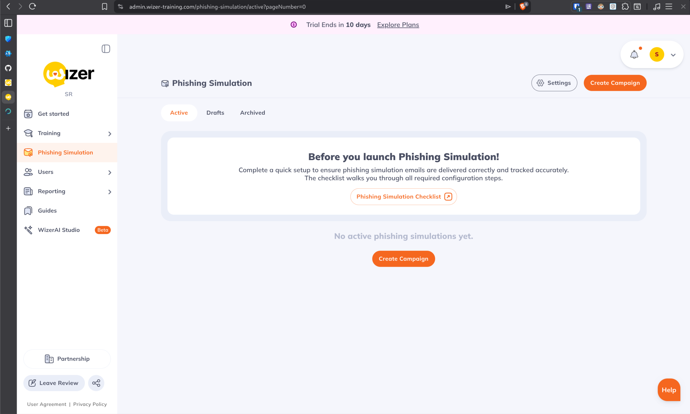
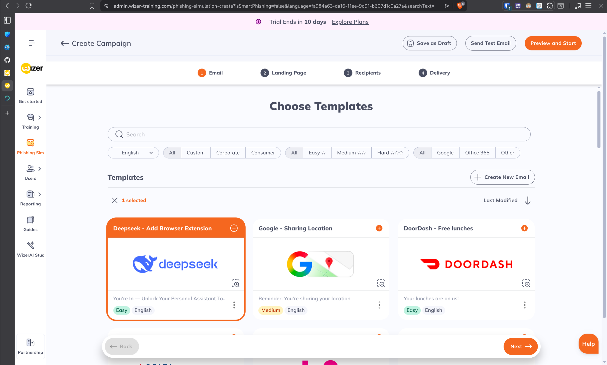
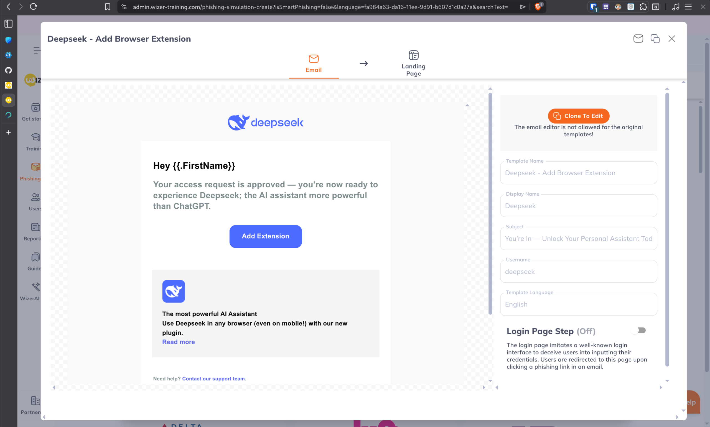
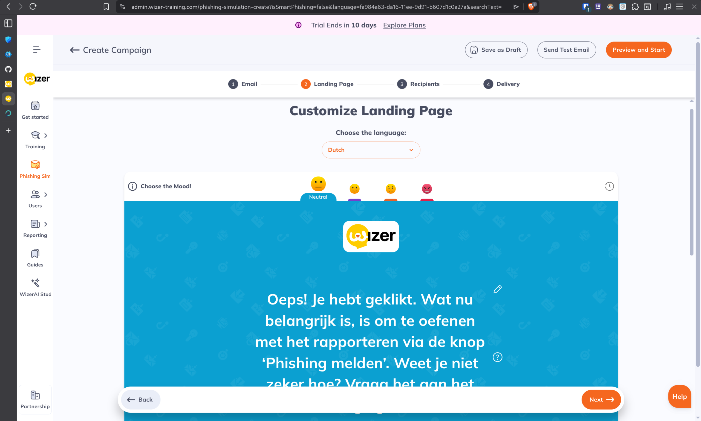
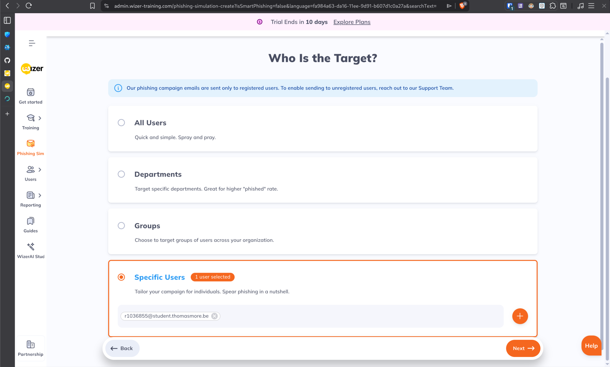
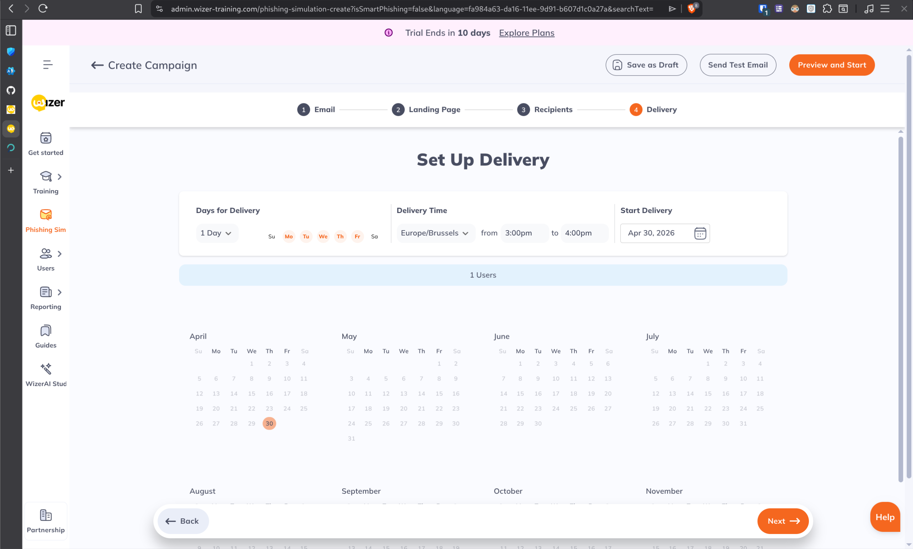
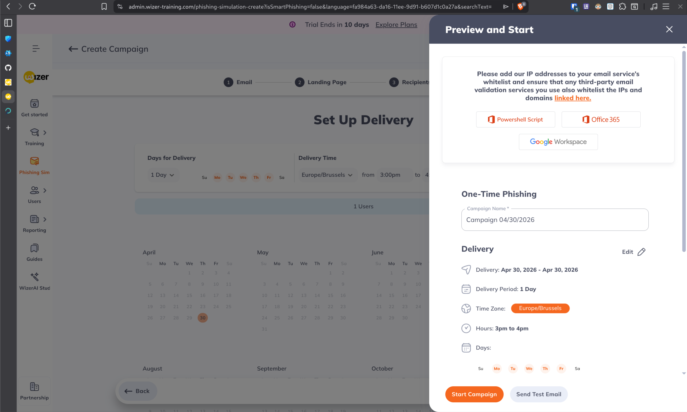
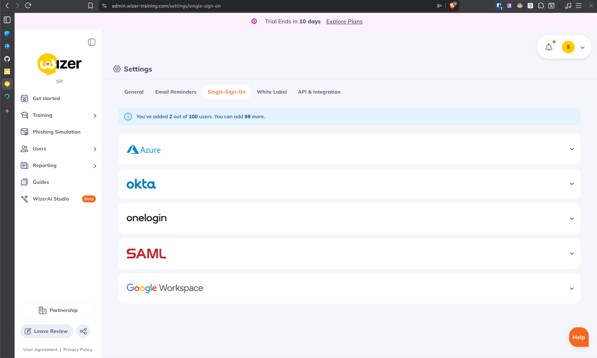

# Wizer Phishing Simulation & Training

[← Back to Project Overview](../README.md)

## Overview
Wizer is a security awareness platform that provides both training modules and phishing simulation capabilities. It is known for its user-friendly interface and "story-based" training videos.

## Pricing & Licensing
During our research, the following pricing and trial information was identified:

- **Free Edition:** Wizer offers a basic free version with limited features and training modules, supporting up to **100 users**.
- **Trial:** A **10-day free trial** is available to test the full "Boost" features, including advanced phishing simulations.
- **Paid Licensing:** The premium version (Wizer Boost) is priced at approximately **$25 per user per year**. 
  - **Note:** The price per user is **volume-dependent**; the cost per license decreases as the total number of users increases. Educational discounts may also be available upon request.

## Key Features
- **Phishing Simulation:** Easy-to-launch campaigns with a variety of templates.
- **Security Awareness Training:** Short, engaging videos designed to keep user attention.
- **Reporting:** Simple dashboards to track who clicked and who completed training.
- **Integration:** Support for SSO and automated user provisioning (in paid versions).

## Evaluation for Students
Wizer is a strong contender for student simulations because:
1. The training content is modern and engaging, which fits the student demographic.
2. The free version allows for basic awareness training without immediate budget requirements.
3. The "Boost" trial allows for a proof-of-concept simulation before committing to licenses.

---

## Phishing Simulation Workflow

The following steps outline the process of setting up a phishing simulation in Wizer Boost.

### 1. Dashboard & Campaign Creation
The phishing simulation dashboard provides a central location to manage active, drafted, and archived campaigns.

### 2. Template Selection
Wizer provides a variety of modern templates, including themes related to AI, social media, and corporate tools.

### 3. Email Customization
Templates can be customized or cloned to fit specific needs. The editor allows for easy modification of the sender name, subject, and email body.

### 4. Landing Page Design
When a user clicks a link, they are directed to a "teachable moment" landing page. These pages can be translated (e.g., into Dutch) to match the target audience.

### 5. Target Selection
Campaigns can be targeted at all users, specific departments, groups, or individual users.

### 6. Delivery Scheduling
Delivery can be spread over several days or hours to make the simulation appear more natural and avoid "over-alerting" the IT department at a single moment.

### 7. Whitelisting & Launch
Before launching, Wizer provides the necessary IP addresses and domains that must be whitelisted in the mail server (e.g., M365) to ensure delivery.

### 8. SSO Integration
Wizer supports a wide range of SSO providers, including Azure AD (Entra ID), Okta, and Google Workspace, making user management seamless.

---
**Status:** Research phase. Initial setup and workflow documentation completed. Testing of the 10-day trial is ongoing.
