# Wizer Phishing Simulation & Training

[← Back to Project Overview](../README.md)

## Overview
Wizer is a security awareness platform that provides both training modules and phishing simulation capabilities. It is known for its user-friendly interface and "story-based" training videos.

## Pricing & Licensing
During our research, the following pricing and trial information was identified:

- **Free Edition:** Wizer offers a basic free version with limited features and training modules, supporting up to **100 users**.
- **Trial:** A **10-day free trial** is available to test the full "Boost" features, including advanced phishing simulations.
- **Paid Licensing:** The premium version (Wizer Boost) is priced at approximately **$8 per user per year if you buy 5000 licenses**. 
  - **Note:** The price per user is **volume-dependent**; the cost per license decreases as the total number of users increases. Educational discounts may also be available upon request.

---

## Technical Setup

### 1. Direct Email Injection
To ensure emails bypass security filters and arrive directly in user inboxes, Direct Email Injection (DEI) should be configured.
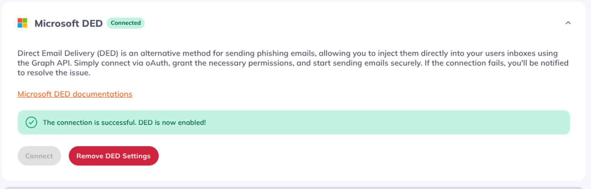
**Documentation:** [Microsoft Direct Email Delivery (DED)](https://learn.wizer-training.com/knowledge/microsoft-direct-email-delivery-ded)

### 2. Single Sign-On (SSO)
Configuring SSO allows users to log in securely using their existing corporate credentials (In this case Entra ID).
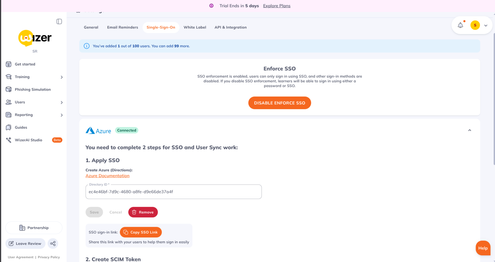
**Documentation:** [Setting up Azure SSO](https://learn.wizer-training.com/knowledge/setting-up-azure-sso)

### 3. SCIM Provisioning
System for Cross-domain Identity Management (SCIM) enables automatic synchronization of users and groups from Entra ID to Wizer.
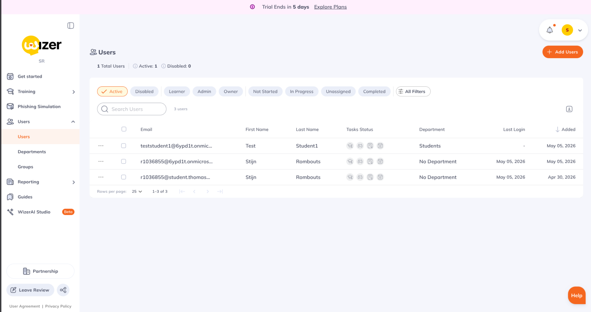
**Documentation:** [Azure SCIM Configuration](https://learn.wizer-training.com/knowledge/azure-scim-automatic-provisioning)

### 4. User Registration
Before a phishing campaign can be successfully delivered, users must be "registered" in the system:
1. **SSO Link Distribution:** Provide users with the specific SSO enrollment link.
2. **First-Time Login:** The user must log in via this link to finalize their registration.
3. **Activation:** Only after this initial login are users marked as "registered" and eligible to receive phishing simulation emails.

---

## Phishing Simulation Workflow
The following steps outline the process of setting up a phishing simulation in Wizer.

### 1. Dashboard & Campaign Creation
The phishing simulation dashboard provides a central location to manage active, drafted, and archived campaigns.
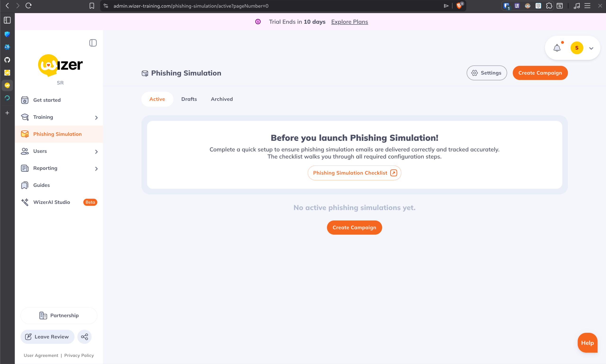

### 2. Template Selection
Wizer provides a variety of modern templates, including themes related to AI, social media, and corporate tools.
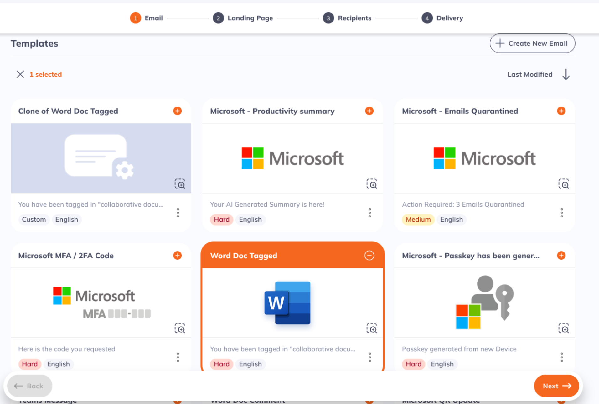
*I selected the "Word Doc Tagged" template*
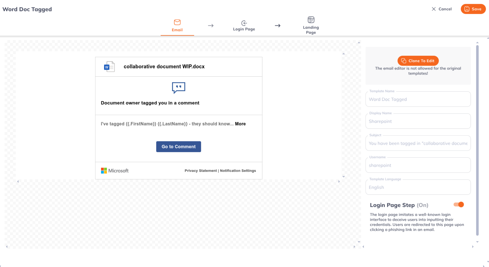
*I also enabled the login page step, where the user is asked to enter their credentials. This is a more realistic scenario for a phishing attack*

### 3. Email Customization
Templates can be customized or cloned to fit specific needs. The editor allows for easy modification of the sender name, subject, and email body.
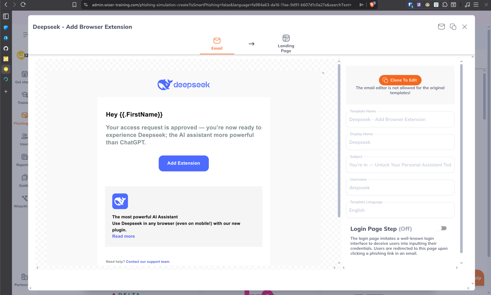

### 4. Landing Page Design
When a user clicks a link, they are directed to a "teachable moment" landing page. These pages can be translated (e.g., into Dutch) to match the target audience.
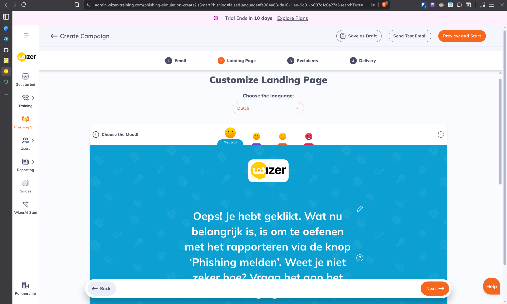

### 5. Target Selection
Campaigns can be targeted at all users, specific departments, groups, or individual users. Groups from Entra ID will show up as "Departments" here.
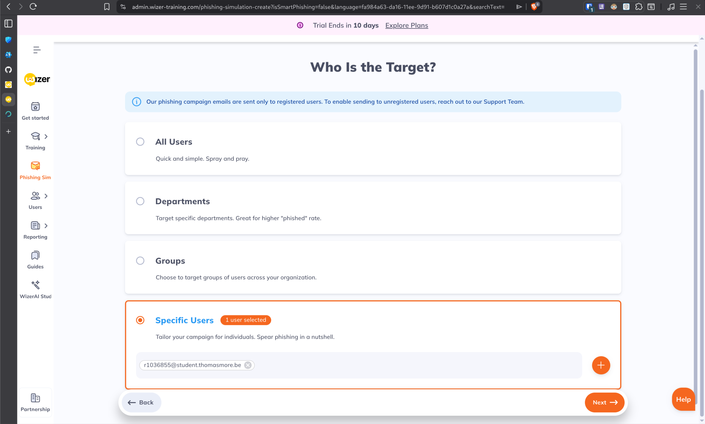

### 6. Delivery Scheduling
Delivery can be spread over several days or hours to make the simulation appear more natural.
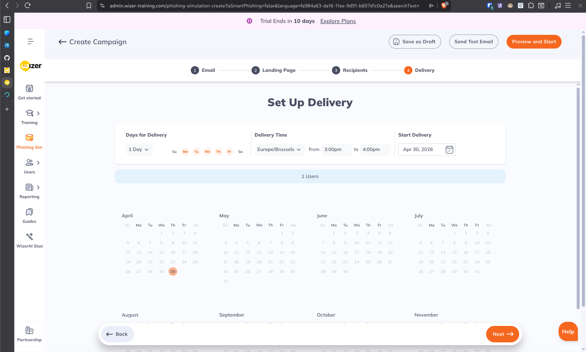

### 7. Launch
Before launching, Wizer provides the necessary IP addresses and domains that must be whitelisted in the mail server (e.g., M365) to ensure delivery. This is not required when using Direct Email Delivery.
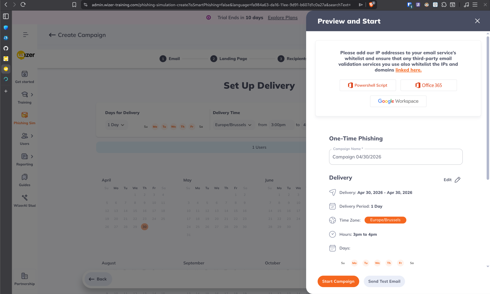

## Email

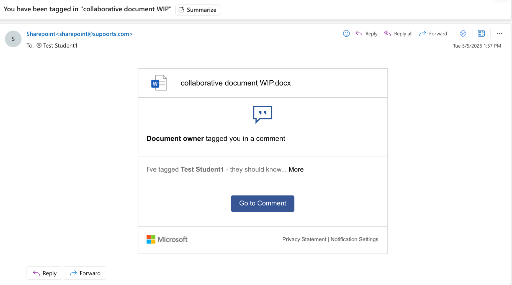
*Email that was sent to the students*
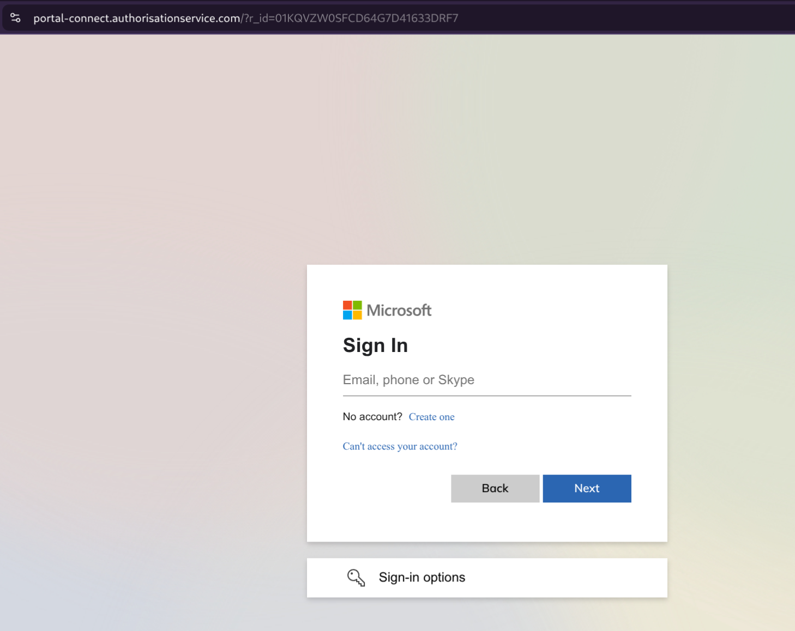
*Login page the students were redirected to after clicking the link in the email*
Note: The login page only requires the user to enter their email address, not their password. After entering the email address the user is shown that they clicked on a phishing link.
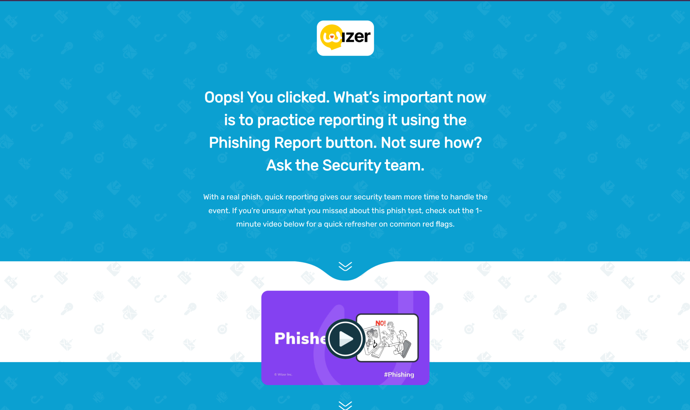
*Shows a short video explaining what phishing is and how to recognize it*
